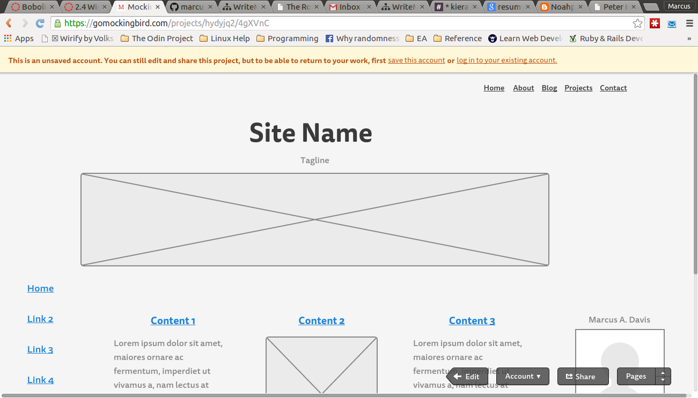
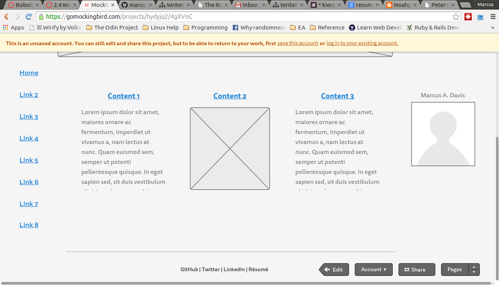
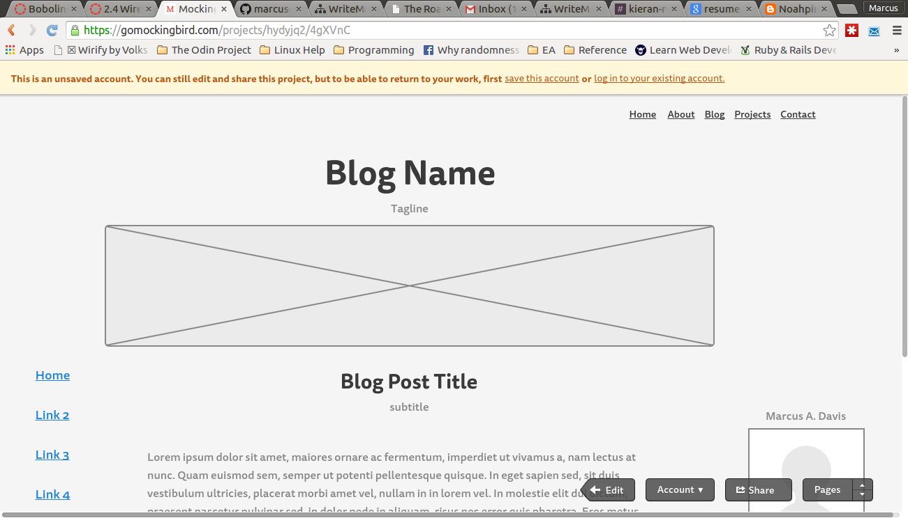
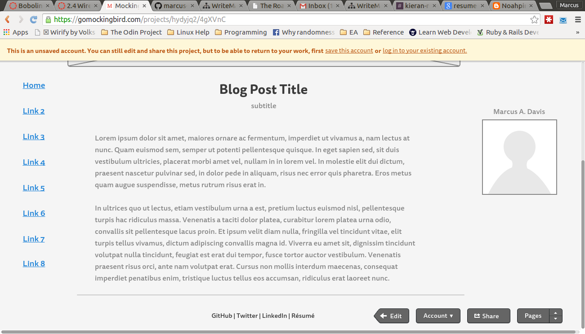

**What is a wireframe?**

**What are the benefits of wireframing?**
The benefits of wireframing are it helps you (and the client) get a clear picture of what you are looking for. In that way it serves the same purpose of a sketch before the real painting begins. It also helps you realize if your site is easy for users to navigate and find what they are looking for.

**Did you enjoy wireframing your site?**
It was enjoyable once I found the right tool, Mockingbird. It was intuitive to use and made implementing the ideas I had a breeze.

**Did you revise your wireframe or stick with your first idea?**
I revised my wireframe quite a bit to make it more attractive. The basic blog layout is still quite simple but I added a subtle line break for the footer, shifted around the size of a few elements and added a bit more detail.

**What questions did you ask during this challenge? What resources did you find to help you answer them?**
I couldn't figure out how to get inline images to work in markdown. I looked at a bevy of resources including Daring Fireball and GitHub but for whatever reason my images wouldn't display. 

**Which parts of the challenge did you enjoy and which parts did you find tedious?**
Finding a useful wireframing tool that I could use in Linux and installing it turned out to be quite the challenge. Indeed, it was so much of one that I ended up giving up and using something from my browser.