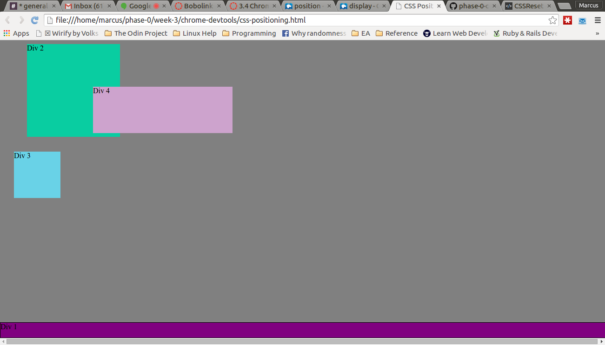

**How can you use Chrome's DevTools inspector to help you format or position elements?**
You can manipulate elements in CSS within Chrome DevTools the same way
you would do so within a CSS file outside of Chrome. This means you can
change the position or format the same way you would in any other CSS
file. For format that works out to setting "display" the way you'd like.
For positioning an element that means setting "position" to absolute,
fixed, static or relative.

**How can you resize elements on the DOM using CSS?**
So if what you want to resize is paragraph font size you'd type the
following: "p { font-size: 20em; }"" or whatever else you'd like to set
the font size to. If you were changing the size of an element like a div
you'd do the following: div {height: 50%; width: 25%;} or however else
you'd like div elements to be sized.

**What are the differences between Absolute, Fixed, Static, and Relative positioning? Which did you find easiest to use? Which was most difficult?**

Static: All HTML elements are by default set to static positioning. Such
elements are not affected by top, bottom, left or right properties.

Relative: these elements respond to top, bottom, left and right properties
and are moved relative to what their normal position would be. Other
elements are not adjusted to fix any gaps created by relative elements.

Fixed: these elements stay in the same place on the page even if the
page is scrolled, they are fixed relative to the viewport. Top, left,
right, and bottom are used to position fixed elements and no gaps are left
where a fixed element normally would have been positioned.

Absolute: these elements are placed relative to the nearest positioned ancestor. That means that if there are no ancestor elements with
positioning, the absolute element will use the document body as an
ancestor and thus move along with page scrolling.

Of the positioning attributes, fixed is easiest to use because it's only
reference point is itself. You don't have to consult any other classes or
ids to know where a fixed element will be as its location doesn't move.
That consistency makes it very easy to conceptualize.

**What are the differences between Margin, Border, and Padding?**
Margin, border and padding are parts of the box model around HTML elements
in CSS. Padding clears space around the content. This area is always
transparent. Border is what goes around the padding and content. You can
stylize the border in different colors and sizes. Finally, padding clears
an area outside the border. This space is also always transparent.

**What was your impression of this challenge overall? (love, hate, and why?)**
It was interesting because I'd never done more than troubleshooting in
Chrome Dev Tools. Using it to play with design choices instead of looking
for the source of errors was a quite different experience. Also, I think
this type of process in which you test out your code basically in real
time is quite valuable.