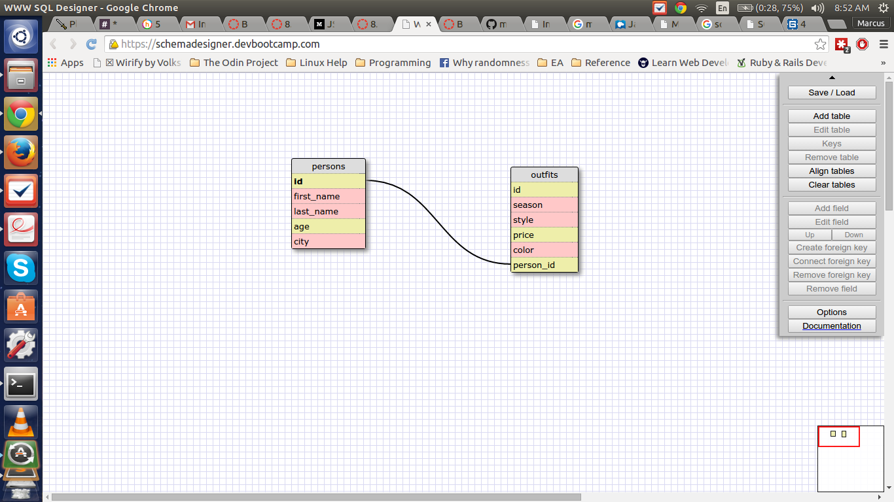

**Release 5**

1.  SELECT * FROM states;
2.  SELECT * FROM regions;
3.  SELECT state_name,population FROM states;
4.  SELECT state_name,population FROM states ORDER BY population DESC;
5.  SELECT state_name FROM states WHERE region_id=7;
6.  SELECT state_name, population_density
    FROM states WHERE population_density > 50
    ORDER BY population_density ASC;
7.  SELECT state_name
    FROM states 
    WHERE population > 1000000 
    AND population < 1500000;
8.  SELECT state_name, region_id
    FROM states
    ORDER BY region_id ASC;
9.  SELECT region_name
    FROM regions
    WHERE region_name
    LIKE "%CENTRAL%";
10. SELECT regions.region_name,states.state_name
    FROM regions 
    JOIN states on regions.id=states.region_id 
    ORDER BY region_id ASC;

**Release 6: Schema**

**Reflect**

**What are databases for?**
Storing data that cab be easily searched and queried. Because the amount
of data you can need to store can be quite large, it very often would be
unsuitable to store data directly in your program as, if this program is
running on a website, make the page slow to load.

**What is a one-to-many relationship?**
One-to-many describes the relationship between two objects. With
relational databases, this describes the relationship between two tables.
For example, suppose you have two tables, person and cars. Each person
can have more than one car. This is a one to many relationship. In SQL,
you can model this relationship by creating the cars table such that each
person is uniquely identified in the cars table but each person can own
more than one car.

**What is a primary key? What is a foreign key? How can you determine which is which?**
Primary keys are a way to identify each entry in the table and make sure
there are no duplicates entries. They are unique to each instance of a
table and every instance must have one.

A foreign key is a way for a table to maintain a tie to unique entries in
another table. Foreign keys are not unique and this is one way you
can tell them apart from primary keys.

**How can you select information out of a SQL database? What are some general guidelines for that?**

When selecting records from a table, all statements must end with a
semi-colon and, by conventions, the keywords "SELECT" and "FROM" are
capitalized.

You can select information from a SQL database using the following
format: SELECT thing_to_select FROM table;

You can select the results from more than one column by using a comma
to separate the columns you wish to call like this:
SELECT thing_one,thing_two FROM table;

You can also use the wildcard "*" to select everything from a table using
this context: SELECT * FROM table;

