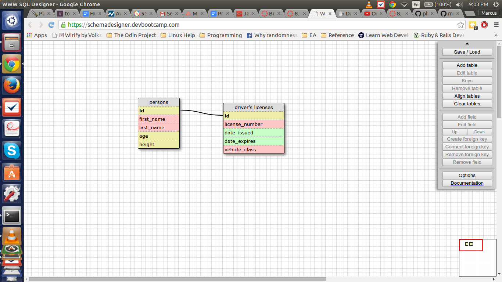
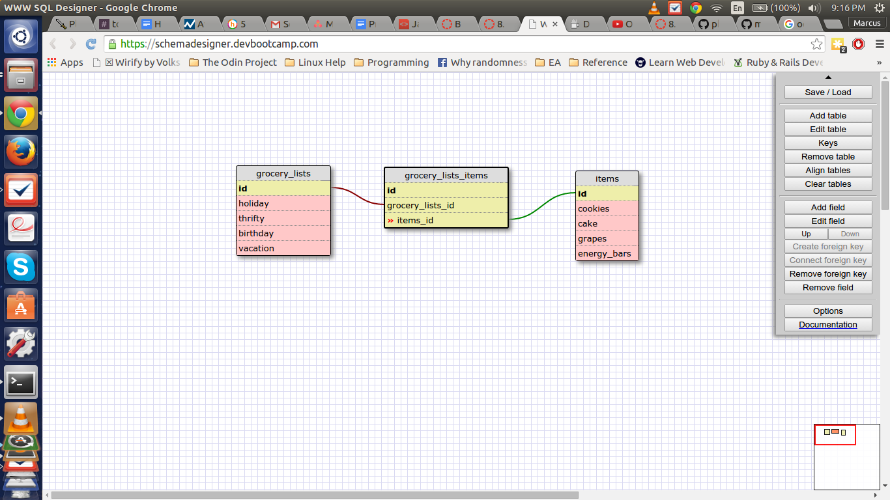

**Create a One-to-one Schema**

A single person can at most have one driver's license and any given
driver license must refer to a single individual. Moreover, a person
can not have a driver's license allowing for null values in the 
driver license table.

**Many to Many Relationships**

**Reflect**

**What is a one-to-one database?**
When one record has at most one child record which shares its unique id,
this is a one-to-one relationship. This means that for a given row in,
say Table 1, there can at most be one matching row in Table 2.

**When would you use a one-to-one database? (Think generally, not in
terms of the example you created).**
One-to-one relationships can be useful for when you want to represent
pairs of objects for which they are uniquely linked (like capitals of 
countries and the countries themselves), and for when you want to reduce
the amount of data stored in a primary record. 

**What is a many-to-many database?**
A many-to-many relationship is a situation in which any given record
in one table can map onto multiple different rows in a second table and
any given row in that second table can do the same to the first table.

**When would you use a many-to-many database? (Think generally, not in
terms of the example you created).**
You'd need to create a many-to-many database whenever the relationship
between two sets of data is such that any given value can be attached
to multiple members of the other set of data. A good example is 
books and authors. Authors can write more than one book and many books
have more than one author.

**What is confusing about database schemas? What makes sense?**
Nothing in particular, in the abstract seeems confusing. As it
makes plenty of sense to have many different possible relationships
between different sets of data as that's the only way to accurately model
reality. That said, coming up with examples a priori for one-to-one
relationships is difficult as it seems you'll mostly need to know the
details of the pratical implementation of a record before knowing
whether it will make sense to model it as one record or two (or more)
when considering to make a single record or create a one-to-one
relationship.